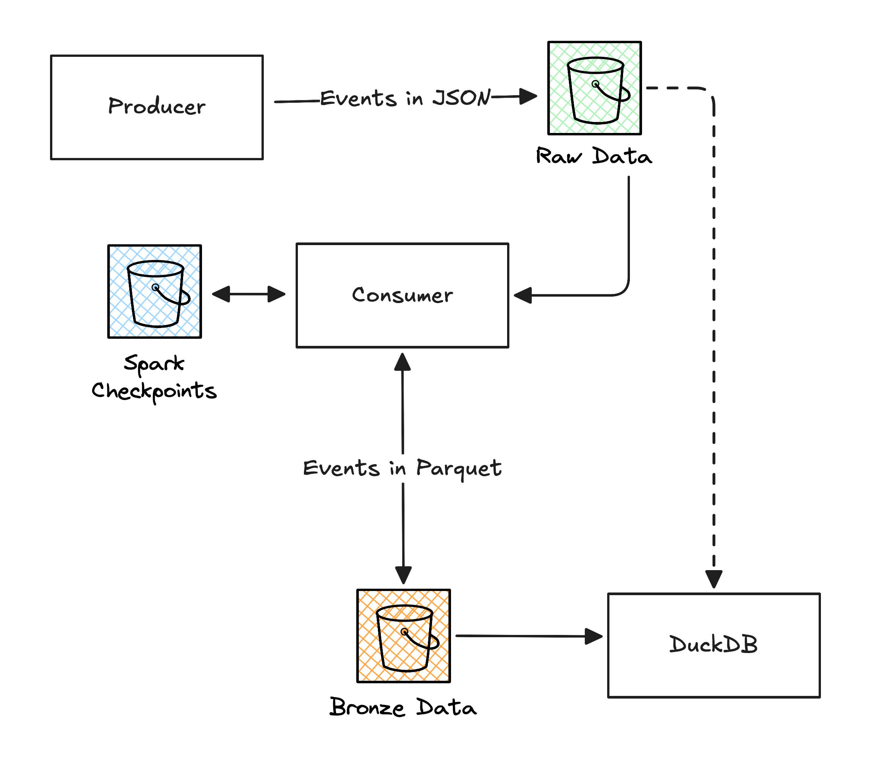

# Spark Streaming Practicum

Practice project to explore and implement streaming data ingestion patterns using Apache Spark Structured Streaming. The project is structured into three components: **producer** is a generator of artificial data implemented in Python, **consumer** is a Spark Streaming–based data ingestion pipeline, **duckdb** is a DuckDB-powered reader of ingested data. Storage is handled by S3-like MinIO.

<picture>
  <source media="(prefers-color-scheme: dark)" srcset="diagrams/architecture-dark.png">
  <source media="(prefers-color-scheme: light)" srcset="diagrams/architecture-light.png">
  
</picture>


## Components

### Producer

Python script that generates events attributed to users.

- Events are being streamed to S3 in JSON format.
- User IDs are picked from a pre-generated list to simulate events from the same user.
- Events are of a single type with a static schema.
- Events are never duplicated.
- Events are never late.
- **Events may have invalid schema.**
- **Batches of events may be corrupted.**

### Consumer

Python script that uses PySpark to process the producer stream.

- Consumes raw batches of data.
- **Handles corrupted batches by routing them to dead-letter queue.**
- **Enforces schema. Routes records with invalid schema to dead-letter queue.**
- Enriches with metadata.
- Converts to Parquet.
- Uses checkpointing to handle job restarts and enforce exactly-once semantics (on batch level).

### DuckDB

DuckDB is used to explore the data. 

- Processed bronze data can be queried though `bronze.events` table.
- Dead-lettered records can be found in `dead_letters.events` table.

### MinIO

MinIO is a local S3-compatible storage. It's used to store raw data, bronze data and Spark checkpoints.

## Usage

> [!NOTE]
> Requires Docker, Docker Compose and Make.

Start with:
```
make start
```
This command will build local Docker images, pull third party ones and start the components in the background.

Open MinIO console in the default web browser.
```
make minio
```
The console requires a login and password. Check the values in the `.env` file under `MINIO_ROOT*`, but they should be `admin` and `password`.

Stop producer and consumer with:
```
make stop
```
Note that it will not stop containers running MinIO, so you can still navigate to the console and see the files.

Stop and cleanup everything:
```
make clean
```

Check logs using:
```
make logs
```

Open Spark UI in the default browser:
```
make spark
```

Create a container with DuckDB shell:
```
make duckdb
```
```sql
select * from bronze.events;
select * from dead_letters.events;
```
